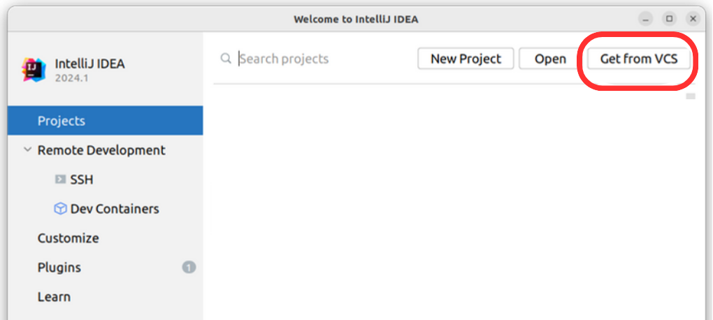
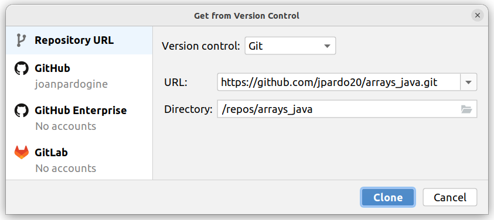

# arrays_java

1. Obre des de **`IntelliJ IDEA Ultimate Edition`**

2. Fent servir <kbd>Get from VCS</kbd>

 

3. I obre el projecte des de la ruta del repostori 
   **`https://github.com/jpardo20/arrays_java.git`**
   i pitja <kbd>Clone</kbd> per clonar el repositori remot al teu ordinador.

